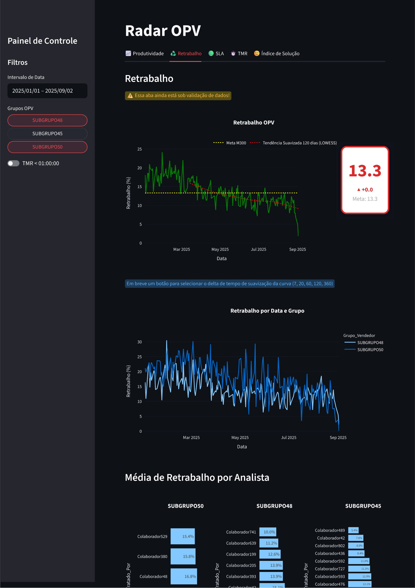
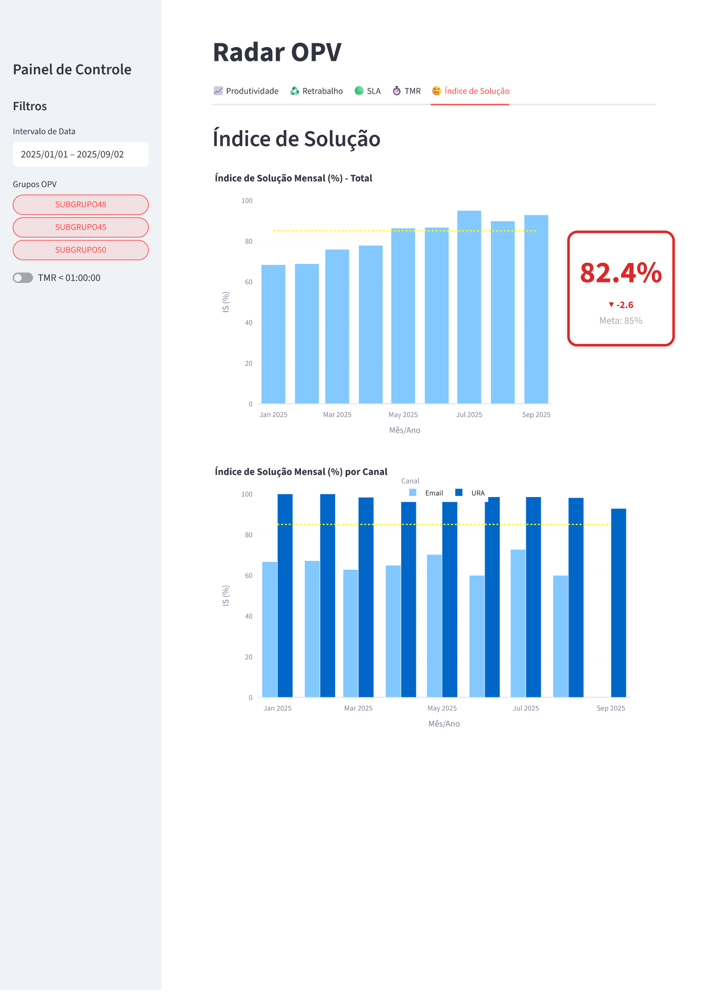
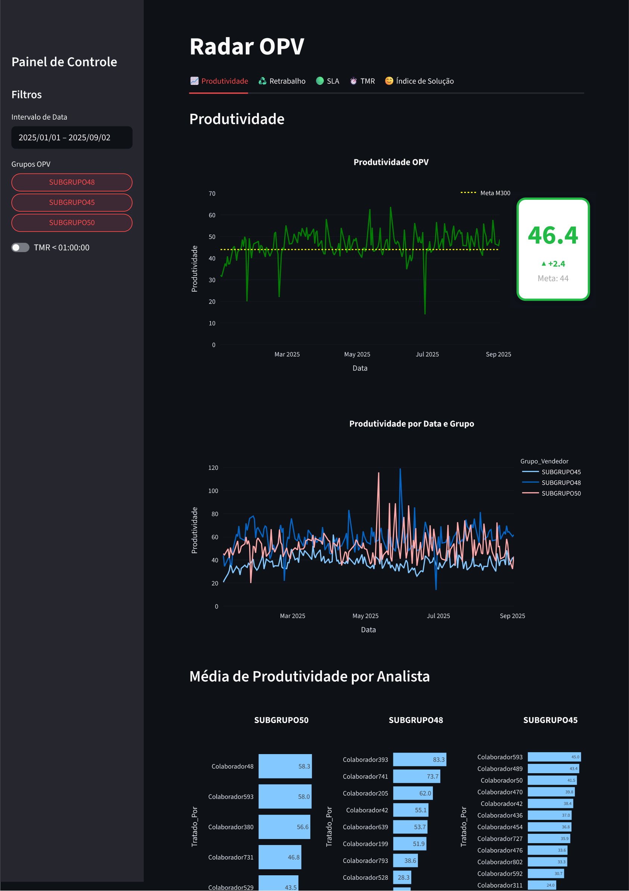

# 📊 Radar OPV

Interactive dashboard developed in **Python + Streamlit** for monitoring and analyzing operational indicators, allowing users to explore metrics by period, group, and different performance dimensions.

The project was designed to transform operational data into visual and actionable information, making it easier to identify trends, deviations from targets, and performance differences between groups and employees.

The goal is to make different levels of analysis — from general monitoring to detailed analysis by group and employee — available in a single environment.

> **Better data → better analysis → better decisions.**

---

## 📸 Preview

Below are some screenshots of the dashboard, showcasing some of the tabs and features included in the project!

### Rework

Visualization of the rework indicator over time, including smoothed trend, target, and comparison between groups.



### Solution Index

Monitoring of the monthly Solution Index, with comparison against the target and breakdown by channel.



### Productivity

Analysis of productivity over the selected period and comparison between groups.



---

## 🎯 Objective

The **Radar OPV** aims to centralize operational indicators in a single interactive environment, allowing users to:

- track the evolution of indicators over time;
- compare results against established targets;
- filter periods and groups;
- identify trends;
- visually compare groups;
- analyze averages by employee;
- monitor different indicators within a single application;
- transform operational data into insights for decision-making.

---

## 🚀 Features

### 📅 Period Filter

Allows users to select the date range used in the analyses.

### 👥 Group Filter

Allows users to select one or more groups to compare performance.

### 📈 Productivity

Indicator used to evaluate the amount of production achieved according to the defined business rule.

- time evolution;
- target;
- trend;
- comparison between groups;
- average by employee.

### ♻️ Rework

Indicator used to identify the proportion of activities that required rework.

- rework evolution;
- smoothed trend;
- comparison against the target;
- comparison between groups;
- average by employee.

### 🟢 SLA

Indicator related to compliance with the expected service/resolution timeframe.

- time evolution;
- comparison against the target;
- SLA performance monitoring;
- comparison between groups;
- consolidated result for the selected period.

### ⏱️ TMR

Indicator of the average response time for tickets, used to monitor the average duration of the evaluated services or processes.

- time evolution;
- comparison against the target;
- average resolution/service time monitoring;
- comparison between groups;
- consolidated result for the selected period.

### 😊 Solution Index

Indicator used to measure the proportion of cases considered solved by the customers themselves (based on customer survey responses collected via Email and/or IVR).

- monthly evolution;
- comparison against the target;
- performance by channel;
- time-based analysis.

---

## 🛠️ Technologies

The project mainly uses:

- **Python**
- **Streamlit**
- **Pandas**
- **Plotly** or an equivalent library for interactive visualizations
- **Git/GitHub** for version control

---

## 📊 Data

The dashboard relies on structured operational data to calculate and display the indicators.

The recommended workflow is:

```text
Raw Data
    ↓
Validation
    ↓
Cleaning
    ↓
Data Processing
    ↓
Indicator Calculation
    ↓
Aggregations
    ↓
Visualizations
    ↓
Dashboard
```

---

## 🗺️ Roadmap

Possible future improvements:

- [ ] Display the date of the last data update
- [ ] Executive summary as the initial view
- [ ] Analyst drill-down
- [ ] Individual/subgroup targets by indicator
- [ ] User access control / Authentication
- [ ] Period comparison (presets such as YTD, Month vs Month, Year vs Year...)
- [ ] Automated alerts
- [ ] Automated regression testing
- [ ] Tooltips explaining indicator calculations and business rules

---

## 👨‍💻 Author

**André Barcellos Coirolo**

Project developed for practical application of:

- data analysis;
- data visualization;
- data engineering;
- Python;
- Streamlit;
- operational indicators;
- data-driven decision-making.